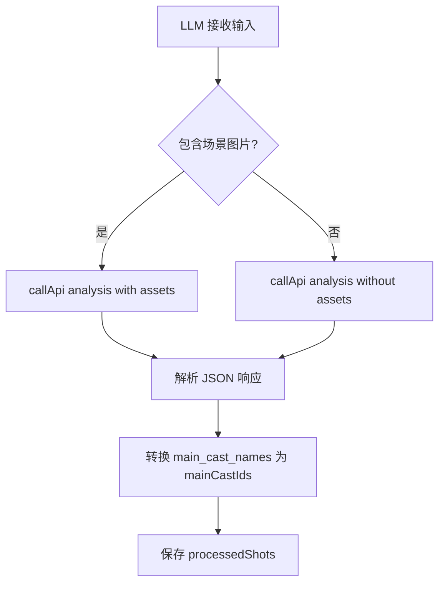

# Ink Silk Phase 4.0 交付文档
## 主角池与场景锚点系统 (Main Cast Pool & Scene Anchor)

**交付日期:** 2026-01-12  
**版本:** v4.0  
**负责人:** Senior Frontend Architect & Prompt Engineer

---

## 📋 Phase 4.0 目标

为"自动分镜"模块引入**资产级一致性系统**，实现：

1. **主角池系统（≤2 个主角）**
   - 从演员库选择 ≤2 个主角，保证跨镜头视觉和声音一致性
   - 自动注入主角参考图（portrait/sheet）到图片生成
   - 主角 ID 传递到 `assembleSoraPrompt`，添加 Featuring 标注

2. **场景锚点系统（1 个场景描述 + ≤3 张图）**
   - 场景描述影响整个分镜的空间一致性
   - 场景图片作为次级参考图（辅助主角图）
   - 场景锚点传递到 `assembleSoraPrompt`，添加 Scene Anchor 块

3. **NPC 系统（非主角角色）**
   - 每个镜头可独立标注 NPC 描述
   - NPC 不使用参考图（纯文本提示）
   - 支持 NPC 作为镜头主体（包括特写）

4. **镜头类型识别**
   - 自动识别：主角镜头 / NPC 镜头 / 纯场景镜头
   - UI 显示不同标签（绿色主角、蓝色 NPC、灰色纯场景）

5. **参考图聚合规则**
   - 有主角：主角图（≤2 张）+ 场景锚点图（≤3 张），总计 ≤5 张
   - 无主角：只用场景锚点图
   - NPC 镜头：不使用任何参考图

---

## 🎯 核心功能清单

### 1. ProjectContext.jsx 升级

**文件:** `src/context/ProjectContext.jsx`

#### 1.1 `assembleSoraPrompt` 函数增强

**新增参数:**
- `mainActorIds: string[]` - 主角 ID 数组（≤2 个）
- `sceneAnchor: { description: string, images: string[] }` - 场景锚点对象

**输出结构变化:**

```
# Global Context
Style: ...
Scene Anchor: {sceneAnchor.description}  // Phase 4.0 新增
Environment: ...
Physics: Natural motion blur, realistic cloth dynamics, subtle wind effects
Audio Style: Cinematic soundscape, immersive ambience

# Main Cast  // Phase 4.0 新增
1. ActorName: Description | Voice: xxx
2. ActorName: Description | Voice: xxx
(Maintain visual and audio consistency for main cast across all shots)

# Timeline Script
[00s-05s] Shot 1: {shotContent}. Featuring: ActorName. NPC: xxx. Camera: xxx. [SFX/Dialogue]
CUT TO:
[05s-10s] Shot 2: ...
CUT TO:
...

# Technical Specs
--ar {aspectRatio} --duration {finalDuration}s --quality high
```

**新增逻辑:**

1. **Scene Anchor 块**
   - 如果 `sceneAnchor.description` 存在，添加到 Global Context
   - 优先级：Global Context → Scene Anchor → Environment

2. **Main Cast 块**
   - 从 `mainActorIds` 查找演员详情
   - 列出主角名称、描述、声线
   - 添加一致性保持提示

3. **Shot 级别 Featuring/NPC**
   - 每个 Shot 独立标注 `mainCastIds`（从主角池选择）
   - 每个 Shot 可选 `npcSpec`（NPC 描述）
   - 格式：`Featuring: ActorName1, ActorName2. NPC: description.`

4. **返回值增强**
   ```javascript
   return {
     prompt: fullPrompt,
     duration: finalDuration,
     actorRef: firstActor.images?.portrait || firstActor.images?.sheet,
     sceneAnchorImages: sceneAnchor?.images || []
   };
   ```

---

### 2. StoryboardStudio.jsx 完整重构

**文件:** `src/components/Modules/StoryboardStudio.jsx`

#### 2.1 新增状态管理

```javascript
// Phase 4.0: 主角池（≤2 个主角）
const [mainActorIds, setMainActorIds] = useState(() => {
  const saved = localStorage.getItem('sb_main_actors');
  return saved ? JSON.parse(saved) : [];
});

// Phase 4.0: 场景锚点（描述 + 1-3 张图）
const [sceneAnchor, setSceneAnchor] = useState(() => {
  const saved = localStorage.getItem('sb_scene_anchor');
  return saved ? JSON.parse(saved) : { description: "", images: [] };
});
```

**持久化:**
- `localStorage.setItem('sb_main_actors', JSON.stringify(mainActorIds))`
- `localStorage.setItem('sb_scene_anchor', JSON.stringify(sceneAnchor))`

#### 2.2 UI 布局变化

**导演控制台（左侧栏）新增两个区域:**

##### A. 主角池选择区（绿色边框）

```jsx
<div className="bg-gradient-to-r from-green-900/20 to-emerald-900/20 border border-green-500/30 rounded-lg p-3">
  <label className="text-xs font-bold text-green-300">主角池（最多 2 个）</label>
  <div className="text-[10px] text-green-200/60">
    来自演员库的资产级角色，保持跨镜头一致性
  </div>
  
  {/* 演员列表 */}
  {actors.map(actor => (
    <button 
      onClick={() => toggleMainActor(actor.id)}
      className={mainActorIds.includes(actor.id) ? "bg-green-600" : "bg-slate-800"}
    >
      {actor.name}
    </button>
  ))}
  
  <div>已选: {mainActorIds.length}/2</div>
</div>
```

**功能:**
- 从演员库选择演员
- 最多选择 2 个
- 选中后显示绿色背景 + ✓ 图标

##### B. 场景锚点区（蓝色边框）

```jsx
<div className="bg-gradient-to-r from-blue-900/20 to-cyan-900/20 border border-blue-500/30 rounded-lg p-3">
  <label className="text-xs font-bold text-blue-300">场景锚点</label>
  <div className="text-[10px] text-blue-200/60">
    影响所有镜头的空间一致性
  </div>
  
  {/* 场景描述 */}
  <textarea 
    value={sceneAnchor.description} 
    onChange={e => setSceneAnchor(prev => ({...prev, description: e.target.value}))} 
    placeholder="例如：赛博朋克城市街道，雨夜，霓虹灯反射在湿滑地面..."
  />
  
  {/* 场景图片（最多 3 张）*/}
  <div className="grid grid-cols-3 gap-2">
    {sceneAnchor.images.map((img, idx) => (
      <div className="relative">
        
        <button onClick={() => removeSceneAnchorImage(idx)}>
          <X size={10}/>
        </button>
      </div>
    ))}
  </div>
  
  {sceneAnchor.images.length < 3 && (
    <label>
      <div className="border-dashed border-blue-500/30">
        <Plus size={16}/> 添加场景图片
      </div>
      <input type="file" accept="image/*" multiple onChange={handleSceneAnchorImageUpload}/>
    </label>
  )}
</div>
```

**功能:**
- 场景描述 textarea
- 上传 ≤3 张场景参考图
- 图片预览 + 删除按钮

#### 2.3 LLM 分析升级 (handleAnalyzeScript)

**System Prompt 变化:**

```
Role: Expert Film Director (Phase 4.0).
Task: Create a Shot List with Main Cast and NPC support.

Main Cast Pool (from actor library, maintain consistency):
${mainActorsInfo.map(a => `- ${a.name}: ${a.desc}`).join('\n')}

Scene Anchor:
${sceneAnchorText || '(No scene anchor)'}

Requirements:
1. Break script into key shots
2. For EACH shot, output:
   - main_cast_names: [] or subset of Main Cast Pool names (can be empty for pure scene/NPC shots)
   - npc_spec: "NPC description" or null (for non-main-cast characters)
   - visual: scene description
   - sora_prompt: detailed shot prompt (action + camera + environment + style)
   - audio: dialogue or SFX
   - duration: e.g. "5s"
   - camera_movement: e.g. "Dolly In"

3. NPC can be shot subject (including close-ups), but don't use reference images
4. Main cast can be absent in some shots (pure scene/NPC/detail shots)

Output JSON Array:
[{
  "id": 1,
  "main_cast_names": ["ActorName1"] or [],
  "npc_spec": "NPC description" or null,
  "visual": "...",
  "sora_prompt": "...",
  "audio": "...",
  "duration": "5s",
  "camera_movement": "..."
}]
```

**API 调用变化:**

```javascript
const assets = sceneAnchor.images.length > 0 ? sceneAnchor.images : undefined;
const res = await callApi('analysis', { 
  system, 
  user: `Script: ${script}\nDirection: ${direction}`,
  assets  // Phase 4.0: 传入场景锚点图片
});
```

**响应处理:**

```javascript
const processedShots = json.map(shot => {
  const mainCastNames = shot.main_cast_names || [];
  const mainCastIds = mainCastNames
    .map(name => {
      const actor = actors.find(a => a.name === name && mainActorIds.includes(a.id));
      return actor ? actor.id : null;
    })
    .filter(Boolean);
  
  return {
    ...shot,
    mainCastIds: mainCastIds,  // Phase 4.0: 转换名称为 ID
    npcSpec: shot.npc_spec || null,
    image_prompt: shot.sora_prompt || shot.visual
  };
});
```

#### 2.4 ShotCard 显示增强

**镜头类型识别:**

```javascript
const hasMainCast = shot.mainCastIds && shot.mainCastIds.length > 0;
const hasNPC = shot.npcSpec && shot.npcSpec.trim();
const isPureScene = !hasMainCast && !hasNPC;
```

**UI 标签:**

```jsx
<div className="flex flex-wrap gap-2 text-[10px]">
  {/* 绿色：主角 */}
  {hasMainCast && (
    <div className="bg-green-900/30 text-green-300 border border-green-800">
      <User size={10}/> 主角: {shot.mainCastIds.map(id => actors.find(a => a.id === id)?.name).join(", ")}
    </div>
  )}
  
  {/* 蓝色：NPC */}
  {hasNPC && (
    <div className="bg-blue-900/30 text-blue-300 border border-blue-800">
      <Users size={10}/> NPC: {shot.npcSpec}
    </div>
  )}
  
  {/* 灰色：纯场景 */}
  {isPureScene && (
    <div className="bg-slate-700/30 text-slate-400 border border-slate-600">
      <MapPin size={10}/> 纯场景
    </div>
  )}
</div>
```

#### 2.5 关键帧生成逻辑 (ShotCard.gen)

**Phase 4.0 参考图选择规则:**

```javascript
const gen = async () => {
  let refImages = [];
  
  // 规则 A：若有主角，使用主角图 + 场景锚点图
  if (shot.mainCastIds && shot.mainCastIds.length > 0) {
    // 主角图（最多 2 张）
    shot.mainCastIds.forEach(actorId => {
      const actor = actors.find(a => a.id === actorId);
      if (actor) {
        const actorImg = actor.images?.portrait || actor.images?.sheet;
        if (actorImg) refImages.push(actorImg);
      }
    });
    
    // 附加场景锚点图（次级参考）
    if (sceneAnchor.images && sceneAnchor.images.length > 0) {
      refImages = refImages.concat(sceneAnchor.images);
    }
  } else {
    // 规则 B：无主角，只用场景锚点图（NPC 不使用参考图）
    if (sceneAnchor.images && sceneAnchor.images.length > 0) {
      refImages = sceneAnchor.images;
    }
  }
  
  // 限制最多 5 张参考图
  refImages = refImages.slice(0, 5);
  
  const url = await callApi('image', { 
    prompt: shot.image_prompt || shot.sora_prompt, 
    aspectRatio: currentAr, 
    useImg2Img: refImages.length > 0, 
    refImages: refImages.length > 0 ? refImages : undefined,
    strength: 0.75
  });
  
  addImageToShot(shot.id, url);
};
```

**关键点:**
- 主角镜头：主角图优先，场景图辅助
- NPC/纯场景镜头：只用场景图
- 总参考图数量 ≤5 张

#### 2.6 组装大分镜 (compileScene)

**主角聚合:**

```javascript
const compileScene = () => {
  const selectedShots = shots.filter(s => selectedShotIds.includes(s.id));
  
  // 聚合所有出现的主角
  const aggregatedMainActorIds = [...new Set(
    selectedShots.flatMap(s => s.mainCastIds || [])
  )];
  
  const result = assembleSoraPrompt(
    selectedShots, 
    direction || "Cinematic, high fidelity, 8k resolution",
    aggregatedMainActorIds,  // Phase 4.0: 传入聚合的主角 ID
    sbAspectRatio,
    sceneAnchor  // Phase 4.0: 传入场景锚点
  );
  
  if (!result) return;
  
  const { prompt: masterPrompt, duration, actorRef, sceneAnchorImages } = result;
  
  // startImg 优先级：首镜关键帧 > actorRef > sceneAnchorImages[0] > null
  let startImg = shotImages[selectedShots[0].id]?.slice(-1)[0] || actorRef || sceneAnchorImages[0] || null;
  
  const newScene = {
    id: Date.now(),
    title: `Scene ${scenes.length + 1} (Shots ${selectedShotIds.join(',')})`,
    prompt: masterPrompt,
    duration: duration,
    startImg: startImg,
    video_url: null,
    shots: selectedShotIds,
    mainActorIds: aggregatedMainActorIds  // Phase 4.0: 存储主角 ID
  };
  
  setScenes([...scenes, newScene]);
  setSelectedShotIds([]);
  setActiveTab("scenes");
  alert("✨ 大分镜组装完成！");
};
```

#### 2.7 AI 导演助手升级 (handleSendMessage)

**System Prompt 变化:**

```
Role: Co-Director (Phase 4.0).
Task: Modify storyboard based on user feedback.

Main Cast Pool: ${mainActorIds.map(id => actors.find(a => a.id === id)?.name).join(", ")}

Modifiable fields per shot:
- sora_prompt (shot description)
- duration (e.g. "5s")
- mainCastIds (array of actor IDs from Main Cast Pool, can be empty)
- npcSpec (NPC description, can be null)

Return JSON array with ONLY the shots you want to modify.
Wrap in ```json ... ```.
```

**应用修改逻辑:**

```javascript
const applyUpdate = () => {
  updates.forEach(upd => {
    const idx = newShots.findIndex(s => s.id === upd.id);
    if (idx !== -1) {
      newShots[idx] = { 
        ...newShots[idx], 
        ...upd, 
        image_prompt: upd.image_prompt || upd.sora_prompt,
        mainCastIds: upd.mainCastIds || newShots[idx].mainCastIds,  // Phase 4.0
        npcSpec: upd.npcSpec !== undefined ? upd.npcSpec : newShots[idx].npcSpec  // Phase 4.0
      };
    }
  });
};
```

#### 2.8 清空逻辑升级 (clearAll)

```javascript
const clearAll = () => {
  if (!confirm("确定清空分镜数据吗？此操作无法撤销。")) return;
  
  // Phase 4.0: 清空主角池和场景锚点
  setMainActorIds([]);
  setSceneAnchor({ description: "", images: [] });
  
  // 清空其他数据
  setShots([]);
  setMessages([]);
  setShotImages({});
  setScript("");
  setDirection("");
  setScenes([]);
  setSelectedShotIds([]);
  setPendingUpdate(null);
  
  // 清空 localStorage
  localStorage.removeItem('sb_main_actors');
  localStorage.removeItem('sb_scene_anchor');
  localStorage.removeItem('sb_messages');
  localStorage.removeItem('sb_ar');
  localStorage.removeItem('sb_lang');
  localStorage.removeItem('sb_script');
  localStorage.removeItem('sb_direction');
  localStorage.removeItem('sb_shots');
  localStorage.removeItem('sb_scenes');
};
```

---

## 🔄 完整工作流程

### 1. 准备阶段

```mermaid
graph LR
A[打开自动分镜] --> B[输入剧本]
B --> C[输入导演意图]
C --> D[选择主角池 ≤2]
D --> E[填写场景锚点描述]
E --> F[上传场景图片 ≤3]
F --> G[点击"生成分镜表"]
```

### 2. LLM 分析阶段



**LLM 输出字段:**

```json
[
  {
    "id": 1,
    "main_cast_names": ["Alice", "Bob"],  // 从主角池选择，可为空
    "npc_spec": "A mysterious stranger in a raincoat",  // NPC 描述，可为 null
    "visual": "Alice and Bob walk down a rainy neon-lit street",
    "sora_prompt": "Cinematic wide shot: Two figures (Alice in red jacket, Bob in black coat) walking through cyberpunk street. Rain puddles reflect neon signs. Slow tracking shot. Moody blue-purple lighting.",
    "audio": "\"We need to find the source\" - Alice",
    "duration": "5s",
    "camera_movement": "Dolly forward"
  }
]
```

### 3. 小分镜生成阶段

```mermaid
graph TB
A[用户点击"生成画面"] --> B{镜头类型?}
B -->|有主角| C[refImages = 主角图 + 场景图]
B -->|无主角 有NPC| D[refImages = 场景图]
B -->|纯场景| D
C --> E[callApi image with refImages max 5]
D --> E
E --> F[添加到 shotImages]
F --> G[显示在 ShotCard]
```

**参考图优先级:**
1. 主角 portrait（优先）
2. 主角 sheet（fallback）
3. 场景锚点图片（辅助）

### 4. 组装大分镜阶段

```mermaid
graph TB
A[用户勾选镜头] --> B[点击"组合为大分镜"]
B --> C[聚合所有 mainCastIds]
C --> D[调用 assembleSoraPrompt]
D --> E[生成 Sora2 Prompt]
E --> F[确定 startImg 优先级]
F --> G[保存到 scenes]
```

**startImg 优先级:**
1. 选中镜头首张关键帧 `shotImages[selectedShots[0].id]?.slice(-1)[0]`
2. `actorRef`（主角 portrait/sheet）
3. `sceneAnchorImages[0]`（场景锚点首图）
4. `null`

### 5. 生成视频阶段

```mermaid
graph LR
A[点击"生成长视频"] --> B[提取 scene.prompt]
B --> C[提取 scene.startImg]
C --> D[callApi video]
D --> E[轮询任务状态]
E --> F[保存 video_url]
```

---

## 📊 数据结构

### Shot 对象（Phase 4.0）

```javascript
{
  id: 1,
  visual: "Scene description",
  sora_prompt: "Detailed cinematic prompt",
  image_prompt: "Image generation prompt",
  audio: "Dialogue or SFX",
  duration: "5s",
  camera_movement: "Dolly In",
  
  // Phase 4.0 新增
  mainCastIds: ["actor-uuid-1", "actor-uuid-2"],  // 主角 ID 数组（≤2）
  npcSpec: "NPC description" | null,  // NPC 描述，可为空
}
```

### Scene 对象（Phase 4.0）

```javascript
{
  id: 1673456789012,
  title: "Scene 1 (Shots 1,2,3)",
  prompt: "完整 Sora2 Prompt（含 Main Cast/Featuring/NPC）",
  duration: 15,
  startImg: "base64 or url",
  video_url: "url or null",
  shots: [1, 2, 3],
  
  // Phase 4.0 新增
  mainActorIds: ["actor-uuid-1"]  // 场景中出现的所有主角
}
```

### Actor 对象（演员库）

```javascript
{
  version: "actorpkg-v1",
  id: "uuid",
  name: "Alice",
  desc: "Young woman, red jacket, short black hair",
  voice_tone: "Female, confident",
  images: {
    portrait: "base64",  // 优先用于参考图
    sheet: "base64"  // 次选
  },
  createdAt: "2026-01-12T...",
  updatedAt: "2026-01-12T..."
}
```

---

## 🎨 UI/UX 细节

### 颜色语义系统

| 元素 | 颜色 | 说明 |
|------|------|------|
| 主角池 | 绿色 `green-500` | 资产级一致性角色 |
| 场景锚点 | 蓝色 `blue-500` | 空间一致性基准 |
| NPC 标签 | 蓝色 `blue-300` | 非主角角色 |
| 纯场景标签 | 灰色 `slate-400` | 无角色镜头 |
| 选中镜头 | 橙色 `orange-500` | 待组合的小分镜 |
| 大分镜 | 橙色/红色渐变 | 最终输出场景 |

### 响应式布局

- **桌面端:** 导演控制台（左侧 320px）+ 分镜列表（右侧 flex-1）
- **移动端:** 堆叠布局（优先测试桌面端）

### 交互反馈

1. **主角选择:** 点击演员卡片，背景变绿色 + ✓ 图标
2. **场景图片上传:** 拖拽或点击虚线框，支持多选（最多 3 张）
3. **镜头勾选:** 点击卡片，边框变橙色 + ring 效果
4. **生成中状态:** Loading spinner + "Rendering..." 文本
5. **成功提示:** alert 弹窗（"✨ 大分镜组装完成！"）

---

## 🧪 自测清单

### 1. 主角池功能

- [x] 从演员库选择演员
- [x] 最多选择 2 个主角
- [x] 选中后显示绿色 + ✓
- [x] 取消选中恢复灰色
- [x] 刷新后保持选择状态（localStorage）

### 2. 场景锚点功能

- [x] 输入场景描述
- [x] 上传 ≤3 张场景图片
- [x] 删除场景图片
- [x] 刷新后保持数据（localStorage）
- [x] 场景图片传递到 LLM 分析

### 3. LLM 分析功能

- [x] 系统提示包含主角池和场景锚点
- [x] 场景图片作为 assets 传入
- [x] 解析 main_cast_names 并转换为 mainCastIds
- [x] 解析 npc_spec
- [x] 生成 processedShots 并保存

### 4. 镜头显示功能

- [x] 显示主角标签（绿色）
- [x] 显示 NPC 标签（蓝色）
- [x] 显示纯场景标签（灰色）
- [x] 标签正确显示演员名称

### 5. 关键帧生成功能

- [x] 主角镜头：使用主角图 + 场景图
- [x] NPC 镜头：只用场景图
- [x] 纯场景镜头：只用场景图
- [x] 参考图数量 ≤5 张
- [x] 生成成功显示图片

### 6. 大分镜组装功能

- [x] 聚合所有主角 ID
- [x] 调用 assembleSoraPrompt 传入主角和场景锚点
- [x] 生成 Sora2 Prompt（含 Main Cast + Featuring + NPC）
- [x] startImg 优先级正确
- [x] 保存到 scenes

### 7. AI 导演助手功能

- [x] 系统提示包含主角池
- [x] 支持修改 mainCastIds
- [x] 支持修改 npcSpec
- [x] 应用修改后正确更新 shots

### 8. 清空功能

- [x] 清空主角池
- [x] 清空场景锚点
- [x] 清空 localStorage 相关键
- [x] 不误伤其他模块数据

---

## 🔍 技术细节

### 1. localStorage 键名规范

| 键名 | 类型 | 说明 |
|------|------|------|
| `sb_main_actors` | JSON Array | 主角 ID 数组 `["uuid1", "uuid2"]` |
| `sb_scene_anchor` | JSON Object | `{description: "", images: []}` |
| `sb_messages` | JSON Array | AI 导演助手对话历史 |
| `sb_ar` | String | 画面比例 "16:9" |
| `sb_lang` | String | 语言 "English" |
| `sb_script` | String | 剧本文本 |
| `sb_direction` | String | 导演意图 |
| `sb_shots` | JSON Array | 小分镜数组 |
| `sb_scenes` | JSON Array | 大分镜数组 |

### 2. 参考图聚合算法

```javascript
function aggregateRefImages(shot, mainActorIds, actors, sceneAnchor) {
  let refImages = [];
  
  // Step 1: 检查是否有主角
  if (shot.mainCastIds && shot.mainCastIds.length > 0) {
    // 添加主角图（优先 portrait，次选 sheet）
    shot.mainCastIds.forEach(actorId => {
      const actor = actors.find(a => a.id === actorId);
      if (actor) {
        const actorImg = actor.images?.portrait || actor.images?.sheet;
        if (actorImg) refImages.push(actorImg);
      }
    });
    
    // 附加场景锚点图
    if (sceneAnchor.images && sceneAnchor.images.length > 0) {
      refImages = refImages.concat(sceneAnchor.images);
    }
  } else {
    // Step 2: 无主角，只用场景锚点图
    if (sceneAnchor.images && sceneAnchor.images.length > 0) {
      refImages = sceneAnchor.images;
    }
  }
  
  // Step 3: 限制最多 5 张
  return refImages.slice(0, 5);
}
```

### 3. Sora2 Prompt 组装示例

**输入:**
- 选中镜头: [Shot 1, Shot 2]
- Shot 1: 
  - mainCastIds: ["alice-uuid"]
  - npcSpec: null
  - sora_prompt: "Alice walks down neon street, rain, tracking shot"
- Shot 2:
  - mainCastIds: []
  - npcSpec: "A stranger in raincoat"
  - sora_prompt: "Close-up of stranger's face, mysterious expression"
- 主角池: [Alice]
- 场景锚点: "Cyberpunk city street, night, rain, neon lights"

**输出 Prompt:**

```
# Global Context
Style: Cinematic, high fidelity, 8k resolution
Scene Anchor: Cyberpunk city street, night, rain, neon lights
Environment: Cyberpunk city street, night, rain, neon lights
Physics: Natural motion blur, realistic cloth dynamics, subtle wind effects
Audio Style: Cinematic soundscape, immersive ambience

# Main Cast
1. Alice: Young woman, red jacket, short black hair | Voice: Female, confident
(Maintain visual and audio consistency for main cast across all shots)

# Timeline Script
[00s-05s] Shot 1: Alice walks down neon street, rain, tracking shot. Featuring: Alice. Camera: Tracking shot.
CUT TO:
[05s-10s] Shot 2: Close-up of stranger's face, mysterious expression. NPC: A stranger in raincoat.

# Technical Specs
--ar 16:9 --duration 10s --quality high
```

---

## 📝 代码注释规范

关键位置添加了 `// Phase 4.0:` 注释，方便追溯：

```javascript
// Phase 4.0: 主角池状态（≤2 个主角）
const [mainActorIds, setMainActorIds] = useState(() => {...});

// Phase 4.0: 场景锚点状态（描述 + 1-3 张图）
const [sceneAnchor, setSceneAnchor] = useState(() => {...});

// Phase 4.0: 参考图选择规则
if (shot.mainCastIds && shot.mainCastIds.length > 0) {
  // 有主角：主角图 + 场景图
} else {
  // 无主角：只用场景图
}

// Phase 4.0: 聚合所有出现的主角
const aggregatedMainActorIds = [...new Set(
  selectedShots.flatMap(s => s.mainCastIds || [])
)];
```

---

## 🚀 下一步计划（后续 Phase）

### Phase 4.1: 演员语音合成

- 集成 TTS API
- 主角自动语音生成（基于 voice_tone）
- 镜头对话自动配音

### Phase 4.2: 场景锚点进阶

- 场景锚点模板库（城市/森林/室内等）
- 场景锚点版本管理（A/B 对比）
- 场景锚点自动提取（从现有图片）

### Phase 4.3: NPC 库系统

- NPC 预设库（快速选择常用 NPC）
- NPC 持久化（重复使用）
- NPC 图片生成（可选参考图）

### Phase 4.4: 主角池扩展

- 支持 >2 个主角（解除限制）
- 主角分组（主要/次要）
- 主角关系图（自动推理互动）

---

## 📁 交付文件清单

1. **核心文件（2 个）**
   - `src/context/ProjectContext.jsx` - 全局上下文升级
   - `src/components/Modules/StoryboardStudio.jsx` - 自动分镜模块完整重构

2. **文档（1 个）**
   - `PHASE_4.0_主角池与场景锚点系统.md` - 本文档

3. **不变文件**
   - `src/components/Modules/CharacterLab.jsx` - 角色工坊（不变）
   - `src/components/Modals/ContractCenter.jsx` - 签约中心（不变）
   - `src/lib/actorStore.js` - IndexedDB 存储（不变）

---

## ✅ 完成标志

- [x] `ProjectContext.jsx` 升级（assembleSoraPrompt 支持 mainActorIds/sceneAnchor）
- [x] `StoryboardStudio.jsx` 完整重构（主角池 + 场景锚点 UI）
- [x] 主角选择逻辑（≤2 个，持久化）
- [x] 场景锚点输入（描述 + ≤3 张图，持久化）
- [x] LLM 分析升级（传入主角池和场景图片）
- [x] ShotCard 显示增强（主角/NPC/纯场景标签）
- [x] 关键帧生成规则（参考图聚合算法）
- [x] 大分镜组装升级（主角聚合 + Sora2 Prompt 生成）
- [x] AI 导演助手升级（支持修改 mainCastIds/npcSpec）
- [x] 清空逻辑完善（清空主角池和场景锚点）
- [x] 文档编写（本文档）
- [x] 代码无 linter 错误

---

## 🎬 结语

Phase 4.0 完成了"自动分镜"模块的**资产级一致性系统**，实现了：

1. **主角池系统**：从演员库选择 ≤2 个主角，保证跨镜头视觉和声音一致性
2. **场景锚点系统**：场景描述 + ≤3 张图，影响整个分镜的空间一致性
3. **NPC 系统**：支持每个镜头独立标注 NPC，不使用参考图
4. **智能参考图聚合**：主角图 + 场景图（≤5 张），自动优化
5. **Sora2 Prompt 增强**：Main Cast 块 + Featuring/NPC 标注

这标志着 Ink Silk 项目从"工具级生图"迈向"工业级资产管理"的关键一步。

**交付日期:** 2026-01-12  
**负责人:** Senior Frontend Architect & Prompt Engineer  
**状态:** ✅ 已完成

---

**Phase 4.0 交付完成！** 🎉

